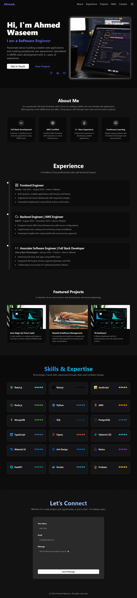

# 🚀 Ahmed Portfolio

A modern, elegant, and responsive personal portfolio built using **React.js**. Showcasing my full-stack skills, tools I work with, and offering an easy way to connect with me. Styled with **Tailwind CSS**, animated with **Framer Motion**, and powered by **Web3Forms** for contact form submissions.

[🌐 Live Demo](https://ahmed-is-a-fullstack-dev.vercel.app)

---

## 📸 Preview

 <!-- Add your actual screenshot in /public or update this line -->

---

## 🧰 Tech Stack

| Tech             | Description                                 |
|------------------|---------------------------------------------|
| **React.js**      | Component-based frontend framework          |
| **Tailwind CSS** | Utility-first CSS for fast design           |
| **Framer Motion**| Powerful animations & transitions           |
| **React Hook Form** | Lightweight and flexible form handling |
| **Zod**          | Type-safe schema validation                 |
| **Web3Forms**    | Form submission via email                   |
| **Sonner**       | Toast-style notifications                   |
| **React Icons**  | Skill & tech icons                          |

---

## ✨ Features

- ⚛️ Built with **React**
- 🎨 **Tailwind CSS** for rapid styling
- 🌙 Dark/Light mode toggle
- 💌 **Working Contact Form** via Web3Forms
- 🔔 Toast messages using **Sonner**
- 🧠 Form management with **React Hook Form**
- ✅ Validation with **Zod**
- 📱 **Responsive** across all screen sizes
- 🎞️ Page transitions using **Framer Motion**
- 🌐 SEO-ready structure

---

## 📦 Packages Used

{
  "react": "^18.x",
  "tailwindcss": "^3.x",
  "framer-motion": "^10.x",
  "react-hook-form": "^7.x",
  "zod": "^3.x",
  "sonner": "^1.x",
  "react-icons": "^4.x"
}

🧪 Folder Structure
.
├── public/               # Static assets (images, etc.)
├── src/
│   ├── components/       # Reusable UI components
│   ├── pages/ or sections/ # Page-level content
│   ├── styles/           # Tailwind & global styles
│   ├── App.jsx           # Main App component
│   └── index.js          # Entry point
├── README.md
└── package.json

🚀 Getting Started

1. Clone the Repository

git clone https://github.com/HafizAhmed223/PortfolioSite.git
cd ahmed-portfolio
2. Install Dependencies

npm install
# or
yarn install
3. Set Up Web3Forms
Create a .env.local file and add your Web3Forms access key:

## env

VITE_WEB3_ACCESS_KEY=your_web3forms_access_key
You can get your access key from Web3Forms.

4. Start the Development Server

npm run dev
# or
yarn dev
📬 Contact Form
Built using React Hook Form

Validated with Zod

Submits via fetch() to Web3Forms

Feedback shown using Sonner toast notifications

Make sure your access key is set up in your .env.local and referenced in your fetch logic.

📱 Responsiveness
This project is built mobile-first and scales beautifully across:

Mobile Devices 📱

Tablets 📲

Desktops 🖥️

🤝 Contributing
Have an idea or improvement? Feel free to fork this repo, make changes, and open a pull request.

📄 License
This project is licensed under the MIT License.

Made with 💙 by Ahmed
Visit My Portfolio
